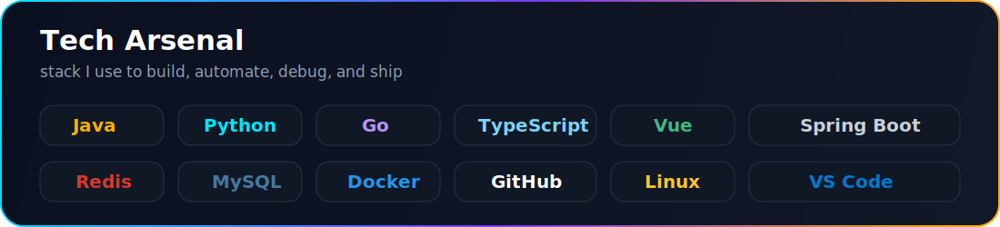
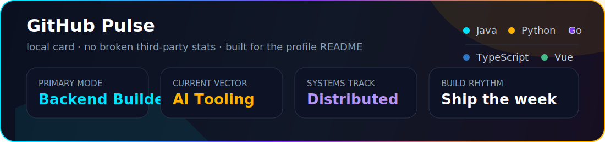
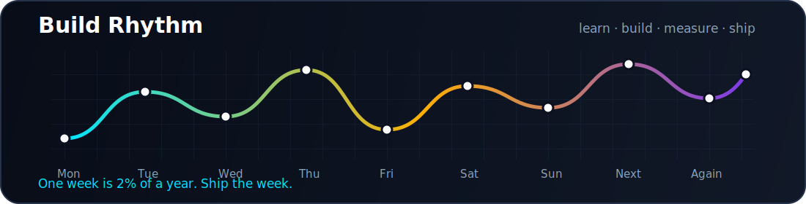

<div align="center">
  

  <br />

  
</div>

<br />

## Hey, I'm maomaozhe.

I build backend systems, AI-powered tools, browser extensions, and the kind of small productivity machines that make everyday work feel sharper.

Right now my playground is where **backend engineering**, **AI agents**, **distributed systems**, and **developer tooling** meet. I like projects that are practical enough to ship, deep enough to learn from, and weird enough to stay interesting.

> One week is 2% of a year. Ship the week.

<br />

## Focus

```txt
Backend Engineering    Java / Spring Boot / Redis / MySQL / RPC / distributed systems
AI Tooling             Python / multi-agent research / automation / LLM workflows
Frontend Experiments   Vue / TypeScript / browser extensions / Raycast tools
Systems Learning       MIT 6.824 / Go / databases / fault tolerance
```

<br />

## Featured Builds

<table>
  <tr>
    <td width="50%">
      <h3><a href="https://github.com/maomaozhe/CompetitorScope">CompetitorScope</a></h3>
      <p>Multi-agent competitive research for product, market, and strategy analysis.</p>
      <p><code>Python</code> <code>Agents</code> <code>Research Automation</code></p>
    </td>
    <td width="50%">
      <h3><a href="https://github.com/maomaozhe/smart-bilingual-reader">smart-bilingual-reader</a></h3>
      <p>Chrome extension for word selection translation, vocabulary reading, and one-click translation.</p>
      <p><code>JavaScript</code> <code>Chrome Extension</code> <code>Productivity</code></p>
    </td>
  </tr>
  <tr>
    <td width="50%">
      <h3><a href="https://github.com/maomaozhe/deer-flow2-own">deer-flow2-own</a></h3>
      <p>Long-horizon SuperAgent harness with sandboxes, memory, tools, skills, subagents, and message gateways.</p>
      <p><code>Python</code> <code>AI Agents</code> <code>Automation</code></p>
    </td>
    <td width="50%">
      <h3><a href="https://github.com/maomaozhe/claude-code-monitor">claude-code-monitor</a></h3>
      <p>Raycast extension for real-time Claude Code session monitoring with hook-based state tracking.</p>
      <p><code>TypeScript</code> <code>Raycast</code> <code>Developer Tools</code></p>
    </td>
  </tr>
  <tr>
    <td width="50%">
      <h3><a href="https://github.com/maomaozhe/MaoRpc">MaoRpc</a></h3>
      <p>A Java RPC framework extended from hands-on backend learning and deeper system design experiments.</p>
      <p><code>Java</code> <code>RPC</code> <code>Networking</code></p>
    </td>
    <td width="50%">
      <h3><a href="https://github.com/maomaozhe/simpleDB">simpleDB</a></h3>
      <p>A lightweight Java database inspired by MySQL core ideas: storage, transactions, indexing, MVCC, SQL parsing, and network communication.</p>
      <p><code>Java</code> <code>Database</code> <code>MVCC</code></p>
    </td>
  </tr>
</table>

<br />

## Tech Arsenal

<div align="center">
  
</div>

<br />

## GitHub Pulse

<div align="center">
  
</div>

<div align="center">
  
</div>

<br />

## Current Coordinates

- Building stronger backend foundations through distributed systems, databases, and RPC.
- Exploring AI agents that can research, code, remember, and use tools across longer horizons.
- Turning recurring pain points into small, useful products: extensions, scripts, monitors, and automation.
- Keeping notes, learning traces, and project experiments visible because progress gets clearer when it has a shape.

<br />

<div align="center">
  <a href="https://github.com/maomaozhe">GitHub</a>
  |
  <a href="https://github.com/maomaozhe/maomaozhe.github.io">Blog</a>
</div>
