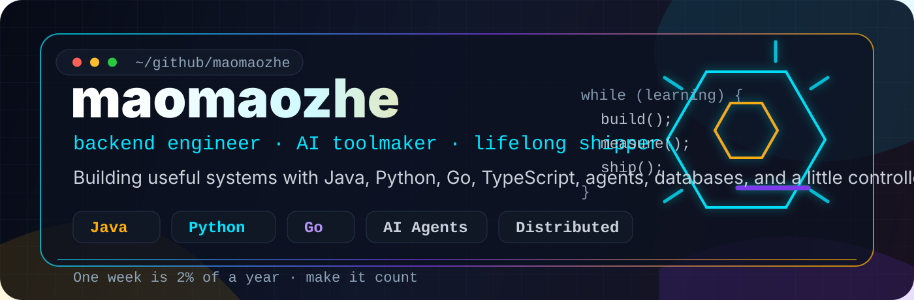

  

# Hi, I'm maomaozhe

关注 **后端工程、AI Agent 和开发工具**。用 Java / Python 构建系统，也把面试准备、信息研究和阅读中的实际需求做成工具。

Building backend systems and practical AI tools, with inspectable code, evidence, and evaluation.

## 正在做：面经研习 · Interview Intelligence

**把零散面经整理成可追溯的题库，用自然语言检索、统计和安排复习。**

输入“场景设计题”，先点选 Agent 应用、业务系统或线上排障等方向，再继续检索。题目可以回到原始问法和来源，查询过程实时显示执行阶段。

[项目与效果图](https://github.com/maomaozhe/interview-helper) · [无凭据体验](https://github.com/maomaozhe/interview-helper#快速体验) · [架构与实现](https://github.com/maomaozhe/interview-helper#系统设计) · [评测与限制](https://github.com/maomaozhe/interview-helper#评测与结果)

`Python` · `FastAPI` · `PostgreSQL` · `Elasticsearch` · `Pi Agent Loop`

- **统计与语义检索分开执行**：频次、排名和完整分页由 SQL 计算，相关问法通过混合检索查找。
- **Agent 规划，主机执行约束**：结构化会话状态、上下文预算、工具权限与幂等请求。
- **反馈可以回放**：记录问题、纠正后重检、明确保存记忆，再纳入评测。
- **结果可核对**：公开架构、离线验证、真实实验口径与失败样本；语义质量仍在持续迭代。

## 其他作品

| 项目 | 解决什么问题 | 主要技术 |
| --- | --- | --- |
| [CompetitorScope / 竞品雷达](https://github.com/maomaozhe/CompetitorScope) | 多 Agent 规划竞品、采集公开资料、横向比较并生成带证据链的报告；支持流式进度与人工确认。 | Python · LangGraph · FastAPI · Next.js |
| [Smart Bilingual Reader](https://github.com/maomaozhe/smart-bilingual-reader) | Chrome 划词翻译、朗读和整页双语阅读。 | JavaScript · Chrome Extension |

## 后端与系统学习

| 项目 | 学习与实践方向 |
| --- | --- |
| [MaoRpc](https://github.com/maomaozhe/MaoRpc) | Java RPC、网络通信与框架设计。 |
| [simpleDB](https://github.com/maomaozhe/simpleDB) | 存储、索引、事务、MVCC 与 SQL 执行。 |

目前关注的问题：如何让统计结果完整、让 Agent 工具调用受约束，以及如何用固定数据、失败样本和回归评测判断改动是否有效。

## Fork 与改造实验

下面是基于上游项目的学习与扩展仓库，上游完整能力归原项目；个人改动以各仓库提交记录为准。

- [deer-flow2-own](https://github.com/maomaozhe/deer-flow2-own)：基于 [bytedance/deer-flow](https://github.com/bytedance/deer-flow)，探索 Agent 工作流、工具和记忆。
- [claude-code-monitor](https://github.com/maomaozhe/claude-code-monitor)：基于 [wuyuxiangX/agent-usage-monitor](https://github.com/wuyuxiangX/agent-usage-monitor)，探索编码 Agent 的运行状态监控。

## 交流与反馈

对面经研习的使用建议、问题复现或功能想法，可以到 [项目 Issues](https://github.com/maomaozhe/interview-helper/issues) 交流。其他项目的使用说明和反馈入口见各自仓库。
